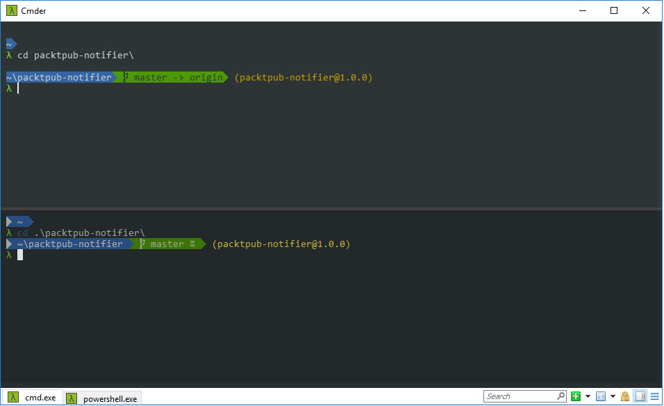

# Cmder - Powerline prompt for `cmd shell`

This is a custom configuration for [Cmder](http://cmder.net/).
It mainly contains :
- a custom prompt inspired by the `agnoster` theme
    - `admin` symbol on black backgound (optional - not displayed by default)
    - `user@hostname` on black backgound (optional - not displayed by default)
    - `current directory path` on blue background
    - `git` folders on green background for clean repo and yellow for dirty
    - `npm` module name and version (black background)

|  |
|:---:|
| with `Ubuntu` theme |

# Requirements
Download [Meslo LG M font](https://github.com/powerline/fonts/tree/master/Meslo%20Slashed)  
You are able to use any font in `Cmder`, but this font must contain the symbols included in the prompt.

## Powershell dependencies
These dependencies are required only if you use a `powershell` console

- [`oh-my-posh`](https://github.com/JanJoris/oh-my-posh)
- [`posh-git`](https://github.com/dahlbyk/posh-git)
- [`Get-ChildItemColor`](https://github.com/joonro/Get-ChildItemColor)

```powershell
Install-Module oh-my-posh -Scope CurrentUser
Install-Module posh-git -AllowClobber -Scope CurrentUser
Install-Module Get-ChildItemColor -Scope CurrentUser
```

## Font Configuration
To show symbols correctly:
- Go to Cmder Settings => Main
- Choose Main console font to be what you prefer
- Choose _Alternative font_ to be _Meslo LG M For Powerline_
- Modify the value of _Unicode ranges_ to add: `E0A0; E0B0; 26A1`
- Save Settings

# Usage

Download all files, and place it (or create symbolic links) in `%CMDER_ROOT%/config` folder.  
Restart Cmder to load the custom configuration.

## `cmd` Customizations

All these modifications require to open a new console in `cmder`.

### Path
The prompt can display either the full path (by default) or only the folder name.  
To change it, add an environment variable `CMDER_CUSTOM_PROMPT_PATH_TYPE` in `user-profile.cmd`  
The value could be either:
- `full` for full path display (`C:\Windows\System32`)
- `folder` for folder name display (`System32`)

```bash
set CMDER_CUSTOM_PROMPT_PATH_TYPE=folder
```

In `full` path mode, the user home path is substituted by a `~` character.  
For disabling this, add an environment variable `CMDER_CUSTOM_PROMPT_TILDE_SUBSTITUTION` in `user-profile.cmd` with the value `false`.  

```bash
set CMDER_CUSTOM_PROMPT_TILDE_SUBSTITUTION=false
```

### Admin
You can modify the prompt to display a `High voltage` symbol at the beginning of the prompt when the current user has admin rights (inactive by default).  
To do this, add an environment variable `CMDER_CUSTOM_PROMPT_DISPLAY_ADMIN` in `user-profile.cmd` with the value `true`

_This feature is quite slow (approximately 0.2~0.3 second)_

```bash
set CMDER_CUSTOM_PROMPT_DISPLAY_ADMIN=true
```

### User
You can modify the prompt to display the current `user` and `hostname` (inactive by default).  
To do this, add an environment variable `CMDER_CUSTOM_PROMPT_DISPLAY_USER` in `user-profile.cmd` with the value `true`

```bash
set CMDER_CUSTOM_PROMPT_DISPLAY_USER=true
```

## Debug
The script `debug.lua` displays the time passed in each lua function called.  
To active this script, add an environment variable `CLINK_PROMPT_DEBUG` with the value `true`

```bash
set CLINK_PROMPT_DEBUG=true
```

## `powershell` Customizations

### Theme
You can change the prompt theme by modifying the line `Set-Theme <themeName>` with the desired theme in `my-user-profile.ps1`.  
List of available themes [`oh-my-posh`](https://github.com/JanJoris/oh-my-posh)

### User
You can modify the prompt to display the current `user` and `hostname`.  
To do this, comment the line `$DefaultUser = $env:USERNAME` in `my-user-profile.ps1`

## Links
[ANSI Color Sequence](http://ascii-table.com/ansi-escape-sequences.php)
